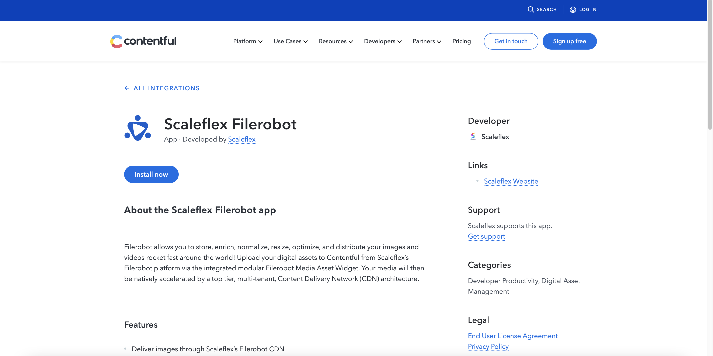
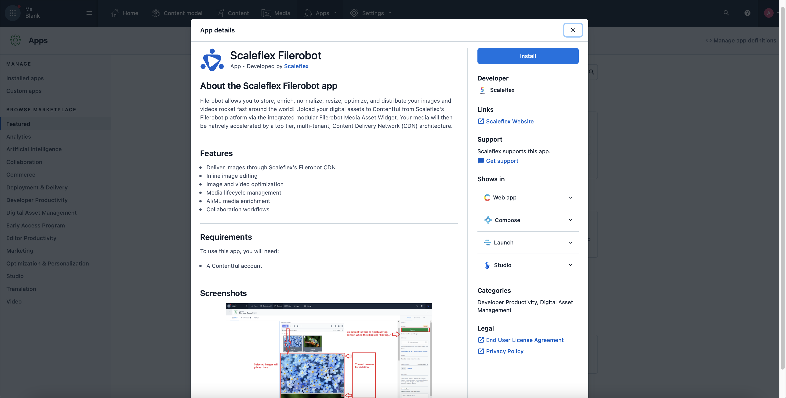
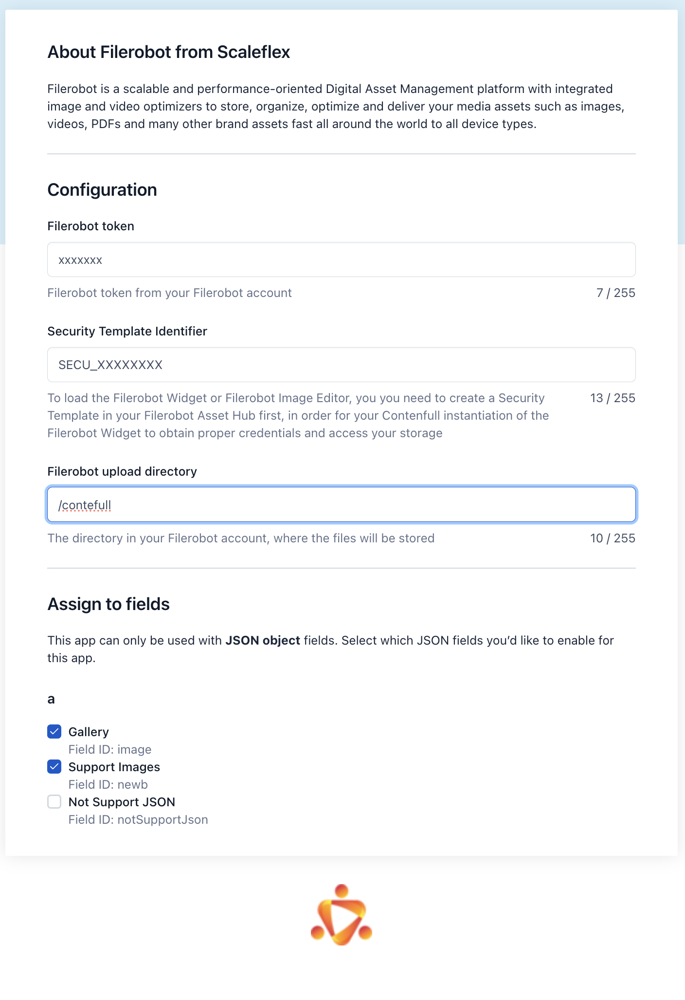
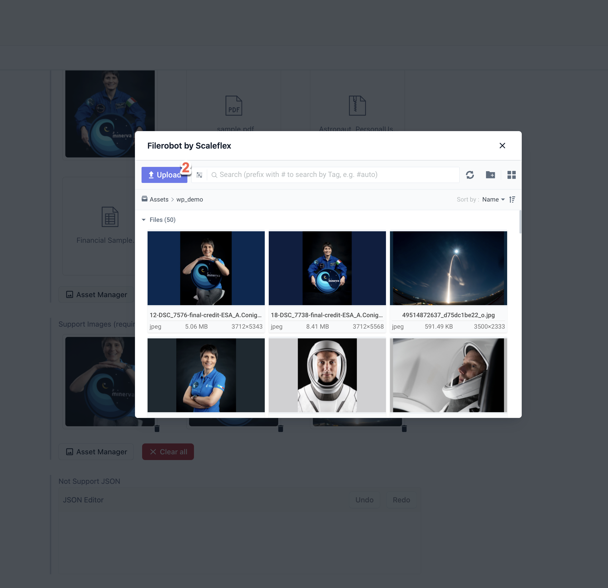
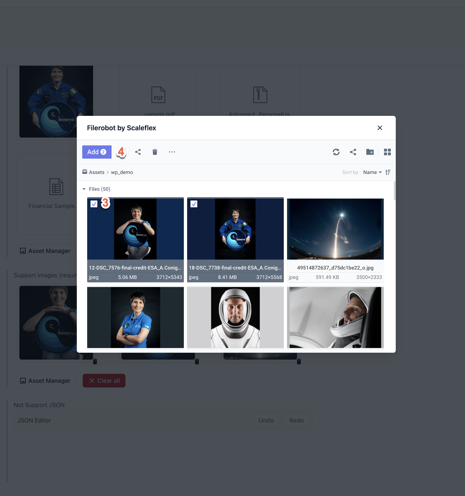
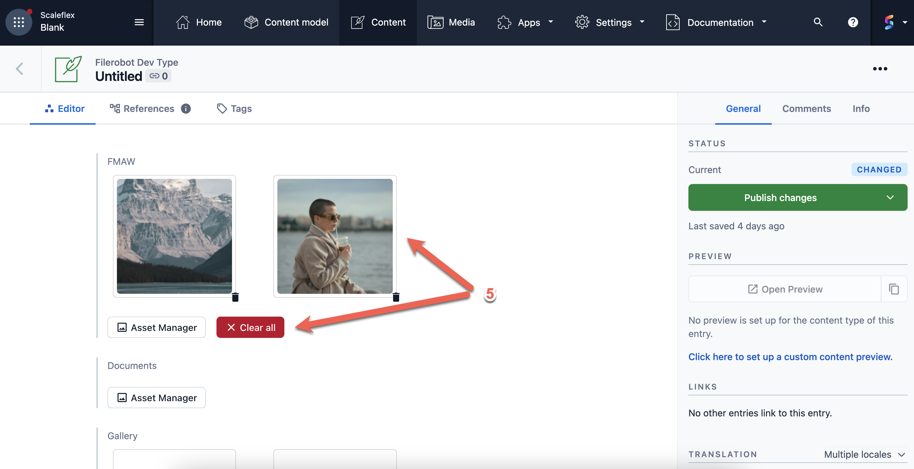

Contentful App 
==================

### Features 

* Asset manager Widget in Contentful Content Management
* Support multiple file type
* Support metadata: You can manage asset metadata from Filerobot and it will show on your Rest/GraphQL Response

There are 3 simple steps for enabling the App on your Contentfull instance

* Have a Contentful Account
* Obtain a Filerobot token (request it [**here**](https://www.scaleflex.com/contact-us){target="_blank"})
* Install the Filerobot App from Marketpkace
* Add your security configuration parameters to access your Filerobot library

### 1. Sign up

Contentful is 100% Cloud Native, so you have to sign up for a hosted CMS at [https://be.contentful.com](https://be.contentful.com)

You’ll get :

``` 
https://app.contentful.com/spaces/{Your Space ID}/home
```

### 2. [Register for a demo](https://www.scaleflex.com/contact-us){target="_blank"} if you don't already have a Filerobot account. {#od_e13c6c61}


### 3. Install from Contentful Marketplace

Find it here [https://www.contentful.com/marketplace/](https://www.contentful.com/marketplace/) and install it.

Or click "install now" on [https://www.contentful.com/marketplace/app/scaleflex-filerobot/](https://www.contentful.com/marketplace/app/scaleflex-filerobot/)







### 4. Configure App



* **Filerobot Token:** Your Filerobot token from the Asset hub interface
* **Security Template Identifier:** Security template ID, found in “Developers” top menu
* **Filerobot upload directory:** This is the top storage folder for your assets.
* **Assign to Fields:** App supported only JSON Object Field, you can specific which Field will be used The App

### 5. Usage

##### Step 1: Click to Asset Manager to open FMAW {#od_83ca8219}


You can upload new asset(2) / or Choose assets




or Choose assets(3) to Add(4)




Then you can delete each item or clear all(5)




### 6. Json Format

```json 
{
   ...
    "fields": {
        "image": [
            {
                "id": "4f9a6f7b-cdfd-5e4e-9ed3-da9f46750000",
                "url": "https://fkklnkdm.filerobot.com/v7/wp_demo/12-DSC_7576-final-credit-ESA_A.Conigli-1.jpg",
                "meta": {
                    "test": null,
                    "title": {
                        "en": "12-DSC_7576-final-credit-ESA_A.Conigli-1"
                    },
                    "animal": null,
                    "description": {
                        "en": ""
                    },
                    "test-number": null,
                    "publish_date": null
                },
                "name": "12-DSC_7576-final-credit-ESA_A.Conigli-1.jpg",
                "type": "image/jpeg",
                "extension": "jpg"
            },
            {
                "id": "f0db7b04-c4eb-5470-86f2-a3ce9b450000",
                "url": "https://fkklnkdm.filerobot.com/v7/wp_demo/18-DSC_7738-final-credit-ESA_A.Conigli.jpg",
                "meta": {
                    "test": null,
                    "title": {
                        "en": "18-DSC_7738-final-credit-ESA_A.Conigli"
                    },
                    "animal": null,
                    "description": {
                        "en": ""
                    },
                    "test-number": null,
                    "publish_date": null
                },
                "name": "18-DSC_7738-final-credit-ESA_A.Conigli.jpg",
                "type": "image/jpeg",
                "extension": "jpg"
            },
            {
                "id": "4f9a6f7b-cdfd-5e4e-9ed3-da9f46750000",
                "url": "https://fkklnkdm.filerobot.com/v7/wp_demo/12-DSC_7576-final-credit-ESA_A.Conigli-1.jpg",
                "meta": {
                    "test": null,
                    "title": {
                        "en": "12-DSC_7576-final-credit-ESA_A.Conigli-1"
                    },
                    "animal": null,
                    "description": {
                        "en": ""
                    },
                    "test-number": null,
                    "publish_date": null
                },
                "name": "12-DSC_7576-final-credit-ESA_A.Conigli-1.jpg",
                "type": "image/jpeg",
                "extension": "jpg"
            },
            {
                "id": "f0db7b04-c4eb-5470-86f2-a3ce9b450000",
                "url": "https://fkklnkdm.filerobot.com/v7/wp_demo/18-DSC_7738-final-credit-ESA_A.Conigli.jpg",
                "meta": {
                    "test": null,
                    "title": {
                        "en": "18-DSC_7738-final-credit-ESA_A.Conigli"
                    },
                    "animal": null,
                    "description": {
                        "en": ""
                    },
                    "test-number": null,
                    "publish_date": null
                },
                "name": "18-DSC_7738-final-credit-ESA_A.Conigli.jpg",
                "type": "image/jpeg",
                "extension": "jpg"
            },
            {
                "url": "https://fkklnkdm.filerobot.com/v7/wp_demo/sample.pdf?func=proxy",
                "id": "3a97dc99-6b18-5602-a604-654925e50000",
                "name": "sample.pdf",
                "type": "application/pdf",
                "meta": {}
            },
            {
                "url": "https://fkklnkdm.filerobot.com/v7/wp_demo/Astronaut_PersonalUse.otf?func=proxy",
                "id": "7a9cff06-ccf2-5531-b754-98f403a50000",
                "name": "Astronaut_PersonalUse.otf",
                "type": "application/vnd.ms-opentype",
                "meta": {}
            },
            {
                "url": "https://fkklnkdm.filerobot.com/v7/wp_demo/Workspace.html?func=proxy",
                "id": "f532448d-e6b1-5b74-adff-67f5a7d50000",
                "name": "Workspace.html",
                "type": "text/html",
                "meta": {}
            },
            {
                "url": "https://fkklnkdm.filerobot.com/v7/wp_demo/Financial+Sample.xlsx?func=proxy",
                "id": "d2c8f2f9-0968-5556-b878-288a41750001",
                "name": "Financial Sample.xlsx",
                "type": "application/vnd.openxmlformats-officedocument.spreadsheetml.sheet",
                "meta": {}
            }
        ],
        ...
    }
}
```